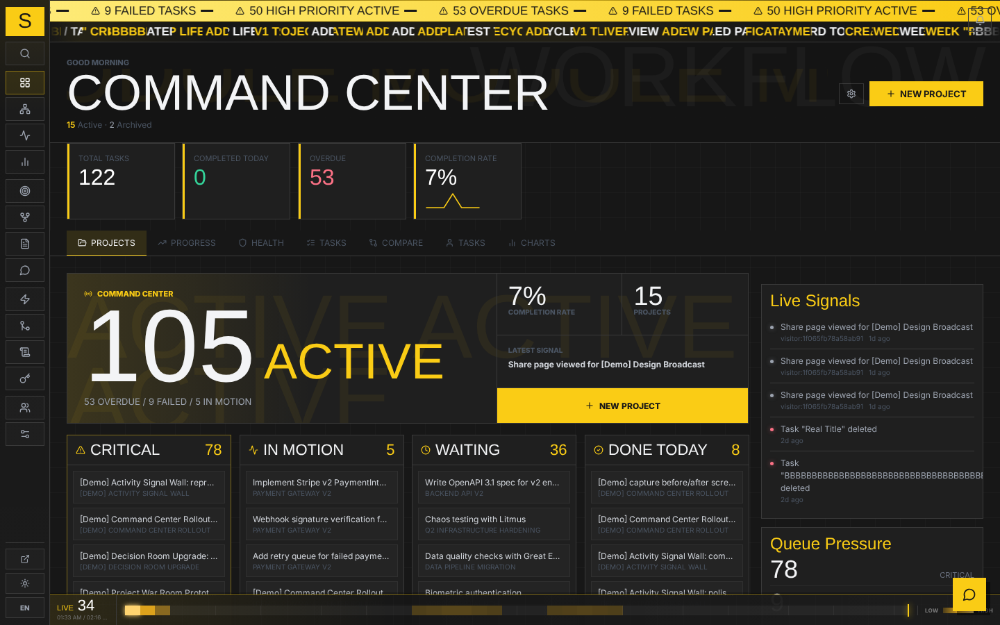

# Shard

[](LICENSE)

A personal multi-identity task management platform with CI/CD integration, AI agent support, and bidirectional issue sync. Built for developers who manage work across multiple roles, repositories, and tools.

> **One instance, one person.** Shard has a single shared password, no accounts and no
> tenants: whoever logs in sees and can change everything. The intended shape is that
> people run their own instance, not that several share one — the multiple *identities*
> are your own roles (work, open source, freelance), not other users. See
> [ADR-0117](docs/adr/0117-someone-who-is-not-us-can-run-this.md).



*Every screen, annotated: [**Visual Tour**](docs/screenshots.md).*

## Key Highlights

- **GitHub / GitLab Issue Sync** — Bidirectional: inbound webhooks create tasks from issues, completing a task closes the external issue via API
- **GitHub PR Linking** — Parse `Fixes #N` refs in PR body, auto-close linked tasks on merge
- **AI Agent Platform** — MCP server (51 tools, local stdio or remote HTTP), External API v1, event subscriptions, agent identity tracking, and tools-schema auto-discovery
- **Multi-Identity** — Manage separate personas (work, open source, freelance) with independent projects, share pages, and analytics
- **CI/CD Webhooks** — Auto-detect GitHub Actions, GitLab CI, Jenkins, Drone, Bitbucket from headers; build history with commit/branch/duration tracking
- **Decision Records as a Graph** — Decisions are a node type with their own relations (`supersedes`, `requires`, `conflicts_with`, `governs`), shown as lineage chains or a directional graph, and carried onto the project's public share page
- **Workflow Automation** — Rules engine with triggers, conditions, and actions; chain rules up to depth 2
- **Critical Path Analysis** — DAG-based computation of the longest dependency chain with slack analysis
- **SLA / Aging Alerts** — Auto-escalate tasks stuck in a status too long; fire notifications for stale work

See [**docs/highlights.md**](docs/highlights.md) for detailed descriptions of all major features.

## All Features

- **Multiple views**: Board (kanban with WIP limits), table, Gantt chart, and calendar per project
- **Time tracking**: Inline start/stop timer on tasks with elapsed time display
- **Customizable dashboard**: Toggle widget visibility with server-persisted preferences
- **LLM assistant**: Built-in AI chat with tool use (Claude, OpenAI, or stub), including batch task creation
- **Real-time sync**: WebSocket live updates + offline queue with IndexedDB
- **Cycles/sprints**: Time-box work into named cycles with progress tracking
- **Labels & decisions**: Color-coded tags and structured decision records per project
- **Comments & attachments**: Threaded markdown comments, file upload/download (max 20 MB)
- **Recurring tasks**: Daily, weekly, monthly, or custom-interval recurrence
- **Task templates**: Reusable structures with subtasks and labels
- **Analytics**: Activity heatmap, burn-down charts, velocity, status trends, and identity-level charts
- **Outbound notifications**: Webhooks (HMAC-signed) and emails with retry backoff
- **Public share pages**: Per-identity shareable pages with optional PIN protection and expiry
- **Command palette**: Fuzzy search across tasks and projects (`Ctrl+K` / `Cmd+K`)
- **Keyboard shortcuts**: Single-key and chord navigation (`?` for help)
- **Search**: Full-text search with pluggable backend
- **Bulk operations**: Multi-select tasks for batch status/priority/pin changes
- **Data import**: Trello JSON, Linear JSON, and GitHub Issues import with auto label creation
- **Weekly digest**: Scheduled email summary with per-project progress and top active projects
- **PWA support**: Installable progressive web app with offline caching and service worker
- **Saved filters & JSON import/export**: Bookmark filters, move data in/out
- **Multi-database**: SQLite (default), PostgreSQL, or MySQL
- **Optional auth**: Password-protect the UI; leave unset for local use

## Quick Start

New here? Run the interactive first-run wizard once — it checks that Docker is
installed (and tells you how to install it if not), walks you through the few
settings that matter, and can start the app for you:

```bash
scripts/setup.sh
```

Prefer to do it by hand? The wizard is optional:

```bash
# First run (or after dependency changes)
docker compose up --build

# Subsequent runs
docker compose up
```

`scripts/setup.sh --check` verifies your environment is ready without changing anything.

- Management UI: http://localhost:5173/
- Public status page: http://localhost:5173/
- API docs (Swagger): http://localhost:8000/docs

### Running it for real (self-hosting)

Everything above starts the **development** stack: source mounted into the containers,
Vite with hot reload on 5173. It is not what you leave running.

To run Shard as an app — production images, one nginx in front, no source mount:

```bash
docker compose -f docker-compose.selfhost.yml up -d
```

That is the whole install. It builds the production images from this checkout, so it
needs no registry account, and every setting has a working default, so it needs no
`.env`. Open **http://127.0.0.1:8090/**.

Building takes a few minutes. To pull the images CI already built and tested instead,
put these two in `.env` beside the compose file and `pull` first:

```bash
echo 'SHARD_IMAGE_PREFIX=callbacknetwork/shard' >> .env
echo 'SHARD_TAG=1.0.0' >> .env          # or `latest`
docker compose -f docker-compose.selfhost.yml pull
docker compose -f docker-compose.selfhost.yml up -d
```

A version tag names one build forever; `latest` follows `main`
([ADR-0137](docs/adr/0137-the-images-are-published-where-somebody-can-pull-them.md)).

Your instance's data is written to `./data` and `./uploads`, which are in the clone
already — they have to be, because a path Compose creates itself is created by the
daemon as root and the app, which runs as uid 1000, cannot then write to it
([ADR-0138](docs/adr/0138-a-bind-mount-a-clone-does-not-carry-is-created-by-root.md)).
If `id -u` on your host is not 1000, set `SHARD_UID` and `SHARD_GID` in `.env` to match.

It binds to loopback on purpose, because `AUTH_PASSWORD` is empty by default and an
empty password means no login gate at all. To reach it from elsewhere on your network,
set both together in `.env`:

```bash
SHARD_BIND=0.0.0.0
AUTH_PASSWORD=something-long
```

Your data is two directories beside the compose file — `./data` (the SQLite database
and its backups) and `./uploads` (task attachments). Copy those two and you have
copied the instance. See [ADR-0117](docs/adr/0117-someone-who-is-not-us-can-run-this.md)
for why this file exists separately from the one CD deploys.

### Upgrading

```bash
scripts/upgrade.sh
```

Pull, build, **migrate**, start — in that order, stopping at the first failure. Do not
upgrade with `docker compose up -d --build` on its own: it starts new code against a
database nothing migrated, and the mismatch does not show up at startup or in the health
check, only later inside a request ([ADR-0136](docs/adr/0136-an-install-has-an-upgrade-path-and-a-version.md)).

Which version you are running is on **Settings → System Status** and in `GET /settings` —
quote it in a bug report, because an image tag does not identify a build. What changed
between versions is in the [changelog](docs/CHANGELOG.md).

## Routes

| Path | Description | Auth |
|------|-------------|------|
| `/` | Public status page | Public |
| `/s/:token` | Public identity share page | Public |
| `/app` | Dashboard (customizable widgets) | Protected |
| `/app/projects/:id` | Project detail (board/table/gantt/calendar) | Protected |
| `/app/identities` | Identity management | Protected |
| `/app/integrations` | Webhook/email/issue-sync config | Protected |
| `/app/api-keys` | API key management | Protected |
| `/app/analytics` | Analytics dashboard | Protected |
| `/app/workflow-rules` | Workflow automation rules | Protected |
| `/app/goals` | Goals & OKR tracking | Protected |
| `/app/activity` | Activity feed | Protected |
| `/app/settings` | System settings | Protected |
| `/login` | Password login | Public |

## Authentication

Set `AUTH_PASSWORD` in your environment to enable the login gate. Leave it empty to disable auth (default for local development).

Empty means *no gate*, not *a weak gate*: anyone who can reach the port has full access to `/app`. The backend logs a warning at startup when neither `AUTH_PASSWORD` nor `AUTH_PROXY_HEADER` is set, and the self-host stack binds to loopback until you change both together.

```bash
AUTH_PASSWORD=mypassword docker compose up
```

The management UI at `/app` requires login; the public status page at `/` is always accessible.

## Environment Variables

| Variable | Default | Description |
|----------|---------|-------------|
| `DATABASE_URL` | `sqlite:///./shard.db` | Database connection (`sqlite`, `postgresql+psycopg`, `mysql+pymysql`) |
| `AUTH_PASSWORD` | _(empty)_ | Password for management UI; empty = no auth |
| `SECRET_KEY` | _(empty)_ | Signs share-PIN session cookies. **Set in production** (`python -c "import secrets; print(secrets.token_hex(32))"`); empty = ephemeral per-process secret |
| `CORS_ORIGINS` | `http://localhost:5173,http://localhost:4173` | Comma-separated allowed CORS origins; set to your deployed frontend origin |
| `SMTP_HOST` | _(empty)_ | SMTP server hostname |
| `SMTP_PORT` | `587` | SMTP port |
| `SMTP_USER` / `SMTP_PASS` | _(empty)_ | SMTP credentials |
| `SMTP_FROM` | _(empty)_ | Sender address |
| `LLM_PROVIDER` | `stub` | LLM provider: `claude`, `openai`, or `stub` |
| `LLM_API_KEY` | _(empty)_ | API key for the chosen LLM provider |
| `LLM_MODEL` | _(varies)_ | Model name (e.g. `claude-sonnet-4-6`, `gpt-4o`) |
| `MCP_HTTP_TOKEN` | _(empty)_ | Bearer token for `/mcp`. Set it and the backend serves remote MCP; leave it empty and the route does not exist |
| `MCP_API_KEY` | _(empty)_ | API key the MCP tools call the backend with |
| `SUMMARY_HOUR` | `8` | Hour (UTC) to send daily summary email |

Copy `.env.example` to `.env` in the project root and adjust:

```env
AUTH_PASSWORD=your_password
SECRET_KEY=change_me_to_a_random_64_char_hex
CORS_ORIGINS=https://your-frontend.example.com
SMTP_HOST=smtp.example.com
SMTP_FROM=notify@example.com
SMTP_USER=notify@example.com
SMTP_PASS=smtp_password

# LLM assistant (optional)
LLM_PROVIDER=claude
LLM_API_KEY=sk-ant-...
LLM_MODEL=claude-sonnet-4-6
```

## Dependency Changes

After editing `backend/requirements.txt` or `frontend/package.json`:

```bash
docker compose build
docker compose up
```

For frontend package additions, also remove the cached node_modules volume:

```bash
docker compose down
docker volume rm $(basename $PWD)_frontend_modules
docker compose up --build
```

## Documentation

- [**Visual Tour**](docs/screenshots.md) — annotated screenshots of the main features
- [**Highlights**](docs/highlights.md) — detailed feature descriptions and usage
- [Architecture](docs/architecture.md) — system design, data models, data flow
- [API Reference](docs/api.md) — all endpoints, request/response schemas
- [Agent Guide](docs/agent-guide.md) — AI agent integration (API, MCP, subscriptions)
- [Deployment](docs/deployment.md) — VPS/production setup guide
- [Integrations](docs/integrations.md) — CI/CD webhook setup
- [Changelog](docs/CHANGELOG.md) — what changed between versions
- [ADRs](docs/adr/) — 130+ architecture decision records: why the system is the way it
  is, including the mistakes that shaped it. Written in a mix of English and Traditional
  Chinese, one file per decision

## Contributing

Contributions are welcome. See [CONTRIBUTING](.github/CONTRIBUTING.md) for the
development setup and quality bar, and the [Code of Conduct](.github/CODE_OF_CONDUCT.md).
Before deploying beyond localhost, read the hardening notes in
[SECURITY](.github/SECURITY.md).

## License

Released under the [MIT License](LICENSE).
