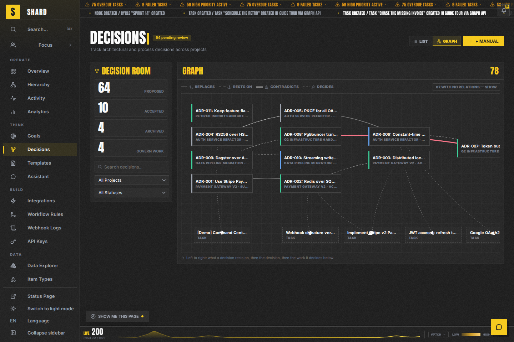
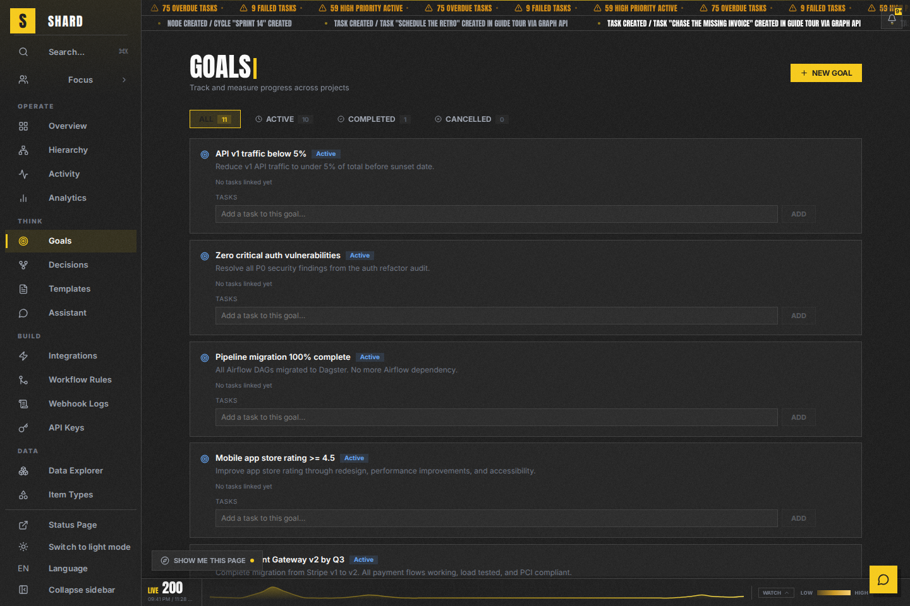
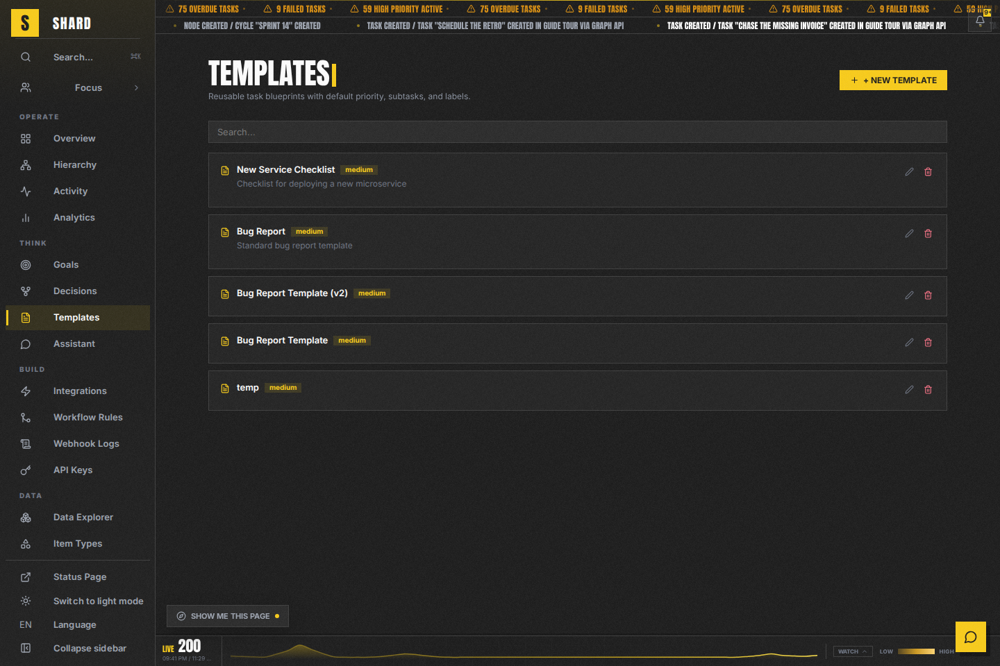
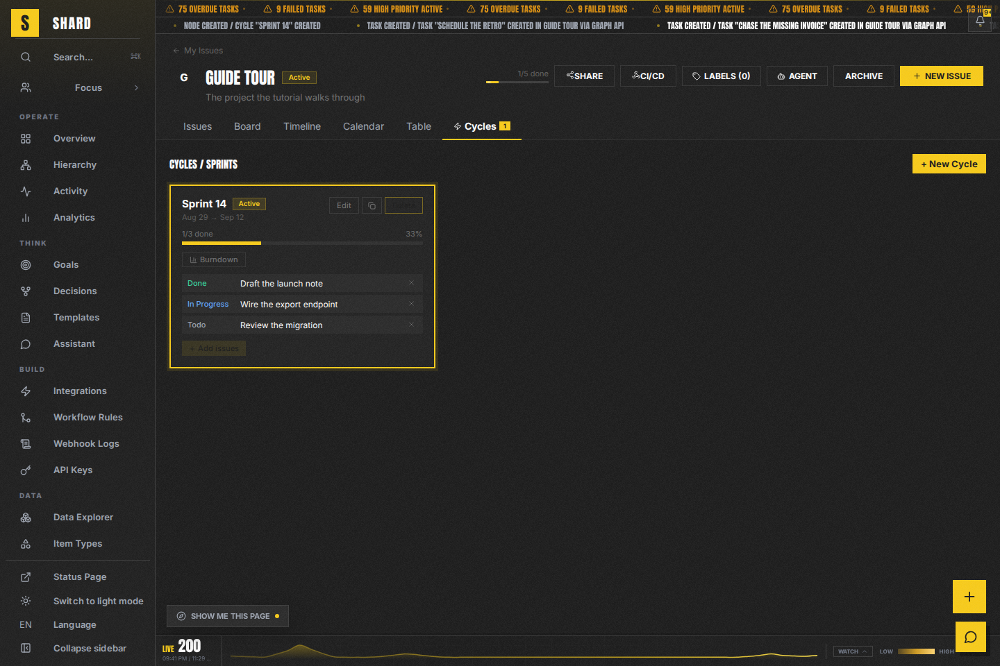
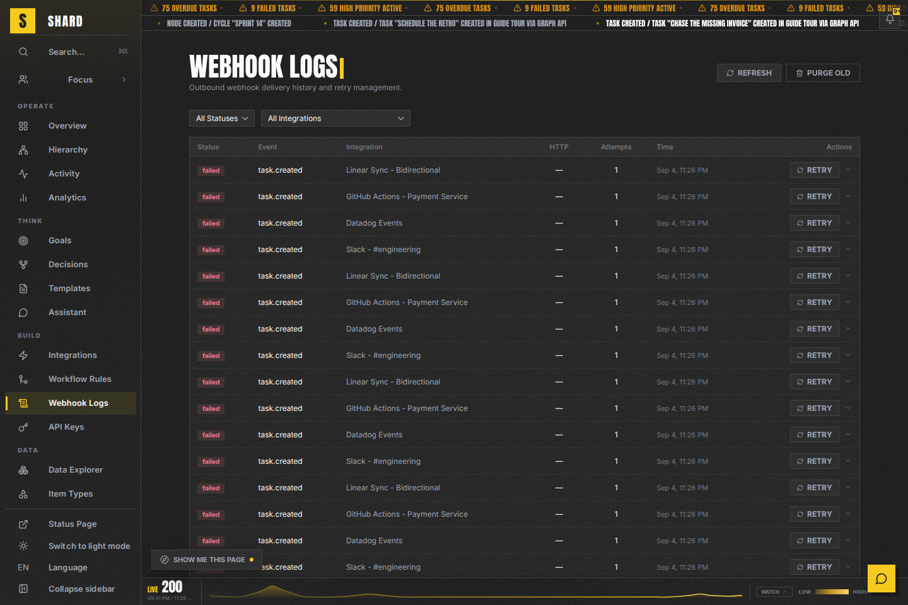
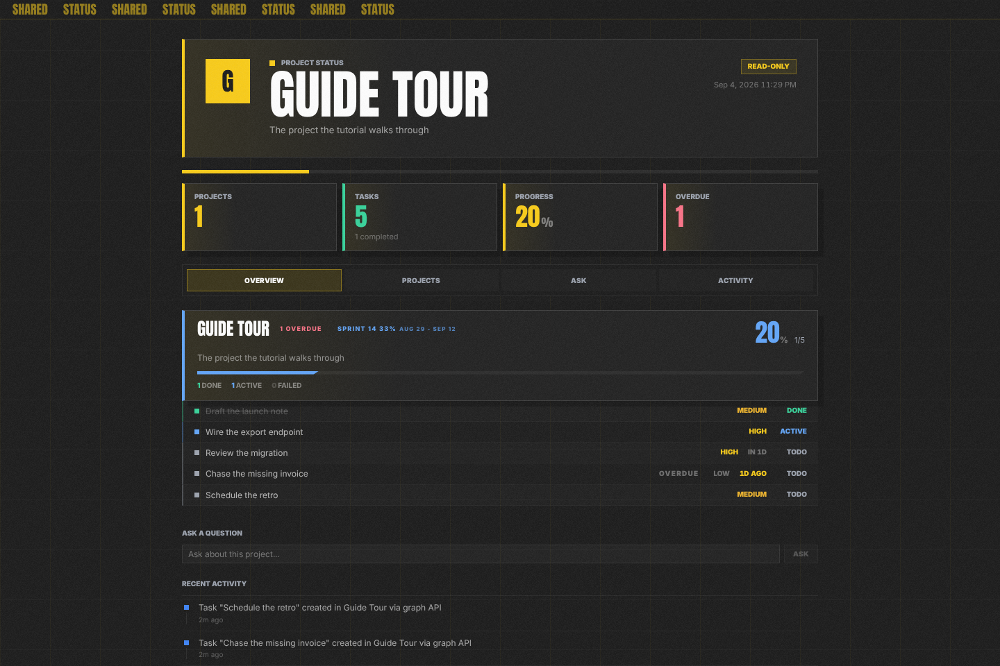
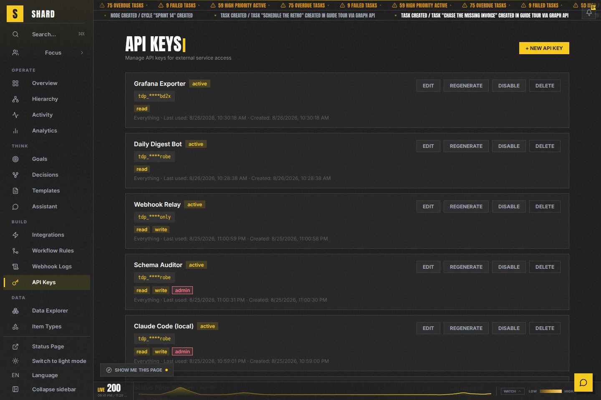
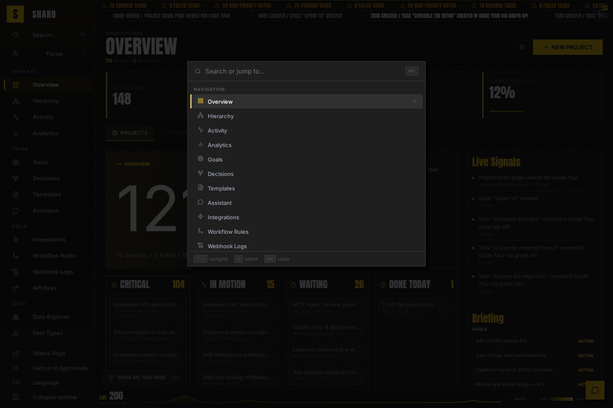
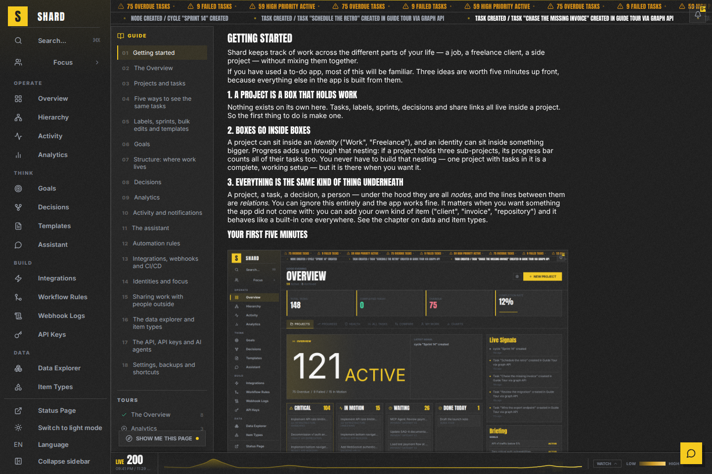

# Visual Tour

A guided look at Shard — a personal, multi-identity task platform with a dark,
high-density "mission control" aesthetic.

**These images are generated, not curated.** `scripts/screenshots.sh` drives the
running dev stack with Playwright and writes both this directory and
`frontend/public/guide/`, which is the copy the in-app guide (`/guide`) serves.
Two copies of one capture, because `frontend/Dockerfile.prod`'s build context is
`./frontend` — an image under `docs/` can never reach the SPA build (ADR-0148).

Regenerate after any change that alters a layout:

```bash
docker compose up          # the stack must be running
scripts/screenshots.sh
```

---

## Overview

The home screen collects everything asking for attention: stat cards, the command
hero, priority lanes (Critical / In Motion / Waiting / Done today), agent workload,
and a briefing of goals and open decisions.

Every number and every line on it is a way to reach the thing it names (ADR-0147).


Clicking a stat card narrows the task list to what that number counted. The
narrowing is named on the page and lives in the URL, so it survives a reload and can
be handed to someone else.


---

## Project views

The same tasks, five ways. The view and the filters live in the URL, so a filtered
board can be bookmarked and shared.

### Issues


### Board (kanban with WIP limits)


### Timeline (Gantt with dependencies)
Dashed connectors are `depends_on` edges; subtasks are indented under their parent
rather than hidden.


### Calendar


### Table


---

## Analytics


---

## Structure

The container hierarchy, drawn four ways from one forest. Parenting resolves within
the visible set: a filtered-out parent promotes its children rather than taking them
with it (ADR-0069).


---

## Decisions

Decision records are their own node type with their own relations — `supersedes`,
`governs`, `requires`, `conflicts_with` — filed under the ancestry they live in
(ADR-0118, ADR-0126, ADR-0127, ADR-0128).


The graph view is deterministic rather than a force layout: column zero is the
foundations, following an arrow rightwards follows a premise to its conclusion, and
governed work sits below (ADR-0128).



---

## Goals and templates

A goal's progress is computed from every project linked to it, so it cannot disagree
with the projects it is made of.




---

## Cycles



---

## Activity


---

## Assistant

Provider-agnostic and switchable at runtime: Claude, OpenAI, or any endpoint
speaking either protocol (ADR-0096, ADR-0097).


---

## Automation and integrations


Every delivery attempt is logged with a widening retry schedule, because a webhook's
failure mode is silence (ADR-0085).



---

## Sharing

A read-only public page for a project or an identity, optionally behind a PIN and an
expiry date. It carries the project's decision records too, because the person most
likely to ask "why is it like this?" is the one who was not in the room (ADR-0120).



---

## Identities


---

## The graph itself

Node types are editable data, not a fixed list in the code. A type declares roles
and fields, and the roles are what the engine reads (ADR-0074, ADR-0119, ADR-0132).


---

## Agents and the API

Anything reachable in the browser is reachable with an API key or over MCP — a
capability that is browser-only is treated as a defect (ADR-0084, ADR-0085).



---

## Settings


---

## Finding your way

`Ctrl-K` searches everything; `G` then `P` turns the same box into a project
switcher, most recently visited first (ADR-0067).



The in-app guide is a chapter per module, and its sidebar lists every one of the
eighteen page tours with a tick beside the ones already taken (ADR-0148, ADR-0152).


